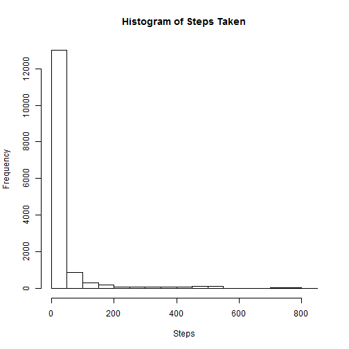
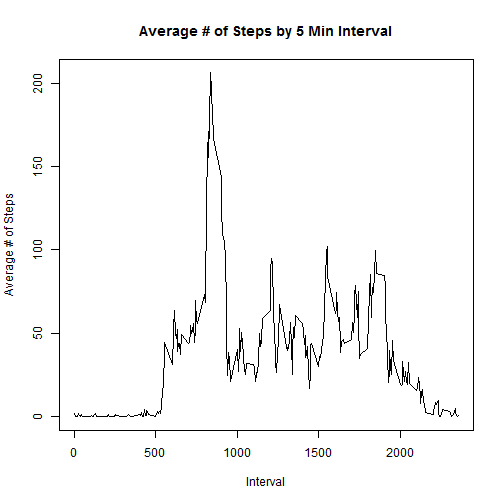
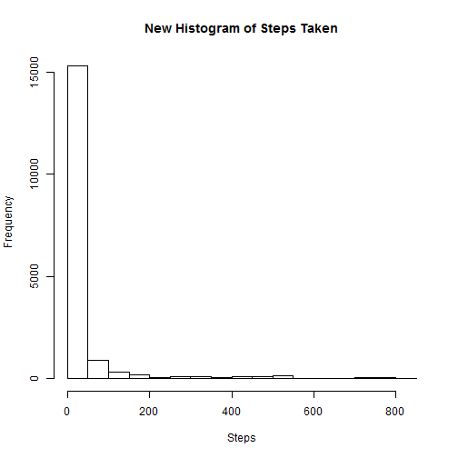
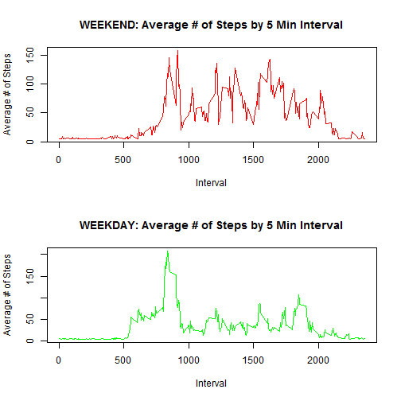

ASSIGNMENT 1, Reproducible research
========================================================

# Reproducible Research: Peer Assessment 1


## Loading and preprocessing the data

Code to Process Data


```r
setwd("c:/r/act")
act<-read.csv("activity.csv", header=TRUE)
act$date <- as.Date (act$date, format="%Y-%m-%d")
act$day<-weekdays(as.Date(act$date))
week <- (unique(act$day))
int <- (unique(act$interval))
act$steps <- as.numeric(act$steps)
```

Here is a summary of the act file and head of act


```r
summary(act)
```

```
##      steps            date               interval        day           
##  Min.   :  0.0   Min.   :2012-10-01   Min.   :   0   Length:17568      
##  1st Qu.:  0.0   1st Qu.:2012-10-16   1st Qu.: 589   Class :character  
##  Median :  0.0   Median :2012-10-31   Median :1178   Mode  :character  
##  Mean   : 37.4   Mean   :2012-10-31   Mean   :1178                     
##  3rd Qu.: 12.0   3rd Qu.:2012-11-15   3rd Qu.:1766                     
##  Max.   :806.0   Max.   :2012-11-30   Max.   :2355                     
##  NA's   :2304
```

```r
head(act,10)
```

```
##    steps       date interval    day
## 1     NA 2012-10-01        0 Monday
## 2     NA 2012-10-01        5 Monday
## 3     NA 2012-10-01       10 Monday
## 4     NA 2012-10-01       15 Monday
## 5     NA 2012-10-01       20 Monday
## 6     NA 2012-10-01       25 Monday
## 7     NA 2012-10-01       30 Monday
## 8     NA 2012-10-01       35 Monday
## 9     NA 2012-10-01       40 Monday
## 10    NA 2012-10-01       45 Monday
```

Histogram

```r
  hist(act$steps[!is.na(act$steps)], main = "Histogram of Steps Taken", xlab = "Steps")
```

 
## What is mean total number of steps taken per day?


```r
for (i in 1:length(week))

by.day <- data.frame(matrix(NA, nrow = 7, ncol = 3))
names(by.day) <- c("day","average","median")

for (i in 1:length(week))

{
  temp <- subset (act,day==week[i])
	bd.mean <- mean(temp$steps, na.rm = TRUE)
	bd.median <- median(temp$steps[temp$steps != 0], na.rm = TRUE)

by.day [i,1] <- week[i]
by.day [i,2] <- bd.mean
by.day [i,3] <- bd.median
}

print(by.day)
```

```
##         day average median
## 1    Monday   34.63   51.0
## 2   Tuesday   31.07   56.0
## 3 Wednesday   40.94   61.5
## 4  Thursday   28.52   47.0
## 5    Friday   42.92   55.0
## 6  Saturday   43.53   60.0
## 7    Sunday   42.63   60.0
```

## What is the average daily activity pattern?


```r
n.per.x <- length ( unique ( act$interval))
per <- data.frame(matrix(NA, nrow = n.per.x, ncol = 2))
names(per) <- c("interval","average")
per$average <- as.numeric (per$average)

for (i in 1:n.per.x)

{
  temp <- subset (act,interval==int[i])
	per.mean <- mean(temp$steps, na.rm = TRUE)

per[i,1] <- int[i]
per[i,2] <- per.mean

}

with(per, plot(per$interval,per$average,col="black",typ="l",ylab="Average # of Steps",xlab="Interval", main = "Average # of Steps by 5 Min Interval"))
```

 

```r
max.per <- per$interval[per$average==max(per$average)]
```

The maximum number of steps on average occured at interval


```r
print(max.per)
```

```
## [1] 835
```

## Imputing missing values

I will use the daily averages to impute for the NA values.


```r
na.steps <- is.na(act$steps) ; na.amt <- length (na.steps[na.steps == TRUE])
```


```r
  raw <- data.frame(matrix(NA, nrow = nrow(act), ncol = 2))
	names(raw) <- c("day","steps")
	
	raw$steps <- act$steps
	raw$day <- act$day

  for (j in 1:length(week)) {
	
		raw$steps[is.na(raw$steps) & raw$day == week[j] ] <- by.day$average[by.day$day == week[j] ]
	
		}
		

		after <- raw
	
			after$week <- act$day
			after$date <- act$date
			after$interval <- act$interval

			#making a weekend vs weekday variable because that's easier

			after$week[after$week == "Saturday" | after$week == "Sunday"] <- "END"
			after$week[after$week != "END"] <- "WORK"

  summary(after)
```

```
##      day                steps           week          
##  Length:17568       Min.   :  0.0   Length:17568      
##  Class :character   1st Qu.:  0.0   Class :character  
##  Mode  :character   Median :  0.0   Mode  :character  
##                     Mean   : 37.6                     
##                     3rd Qu.: 34.6                     
##                     Max.   :806.0                     
##       date               interval   
##  Min.   :2012-10-01   Min.   :   0  
##  1st Qu.:2012-10-16   1st Qu.: 589  
##  Median :2012-10-31   Median :1178  
##  Mean   :2012-10-31   Mean   :1178  
##  3rd Qu.:2012-11-15   3rd Qu.:1766  
##  Max.   :2012-11-30   Max.   :2355
```

```r
  head(after,10)
```

```
##       day steps week       date interval
## 1  Monday 34.63 WORK 2012-10-01        0
## 2  Monday 34.63 WORK 2012-10-01        5
## 3  Monday 34.63 WORK 2012-10-01       10
## 4  Monday 34.63 WORK 2012-10-01       15
## 5  Monday 34.63 WORK 2012-10-01       20
## 6  Monday 34.63 WORK 2012-10-01       25
## 7  Monday 34.63 WORK 2012-10-01       30
## 8  Monday 34.63 WORK 2012-10-01       35
## 9  Monday 34.63 WORK 2012-10-01       40
## 10 Monday 34.63 WORK 2012-10-01       45
```

```r
hist(after$steps[!is.na(after$steps)], main = "New Histogram of Steps Taken", xlab = "Steps")
```

 


```r
after.by.day <- data.frame(matrix(NA, nrow = 7, ncol = 3))
names(after.by.day) <- c("day","average","median")

for (i in 1:length(week))

{
  temp <- after[after$day==week[i],]
	bd.mean <- mean(temp$steps, na.rm = TRUE)
	bd.median <- median(temp$steps[temp$steps != 0], na.rm = TRUE)

after.by.day [i,1] <- week[i]
after.by.day [i,2] <- bd.mean
after.by.day [i,3] <- bd.median
}

print(after.by.day)
```

```
##         day average median
## 1    Monday   34.63  34.63
## 2   Tuesday   31.07  56.00
## 3 Wednesday   40.94  40.94
## 4  Thursday   28.52  28.52
## 5    Friday   42.92  42.92
## 6  Saturday   43.53  43.53
## 7    Sunday   42.63  42.63
```

**Strangely enough there doesn't seem to be any difference with mean but there is an average with the medians**

Just to check if there are indeed no more NAs


```r
print(unique(is.na(after$steps)))
```

```
## [1] FALSE
```

## Are there differences in activity patterns between weekdays and weekends?


```r
weekend <- after[after$week == "END",]
weekday <- after[after$week == "WORK",]
```
First the weekend table

```r
		we.per.x <- length ( unique (weekend$interval))
		we.per <- data.frame(matrix(NA, nrow = we.per.x, ncol = 2))
		names(we.per) <- c("interval","average")
		we.per$average <- as.numeric (we.per$average)

			for (i in 1:we.per.x)

			{
			temp <- subset (weekend,interval==int[i])
			per.mean <- mean(temp$steps, na.rm = TRUE)

			we.per[i,1] <- int[i]
			we.per[i,2] <- per.mean
			}

print(summary(weekend,10))
```

```
##      day                steps           week          
##  Length:4608        Min.   :  0.0   Length:4608       
##  Class :character   1st Qu.:  0.0   Class :character  
##  Mode  :character   Median :  0.0   Mode  :character  
##                     Mean   : 43.1                     
##                     3rd Qu.: 42.6                     
##                     Max.   :785.0                     
##       date               interval   
##  Min.   :2012-10-06   Min.   :   0  
##  1st Qu.:2012-10-18   1st Qu.: 589  
##  Median :2012-10-31   Median :1178  
##  Mean   :2012-10-31   Mean   :1178  
##  3rd Qu.:2012-11-12   3rd Qu.:1766  
##  Max.   :2012-11-25   Max.   :2355
```

Next the weekday table

```r
		wd.per.x <- length ( unique (weekday$interval))
		wd.per <- data.frame(matrix(NA, nrow = wd.per.x, ncol = 2))
		names(wd.per) <- c("interval","average")
		wd.per$average <- as.numeric (wd.per$average)

			for (i in 1:wd.per.x)

			{
			temp <- subset (weekday,interval==int[i])
			per.mean <- mean(temp$steps, na.rm = TRUE)

			wd.per[i,1] <- int[i]
			wd.per[i,2] <- per.mean
			}

print(summary(weekday,10))
```

```
##      day                steps           week          
##  Length:12960       Min.   :  0.0   Length:12960      
##  Class :character   1st Qu.:  0.0   Class :character  
##  Mode  :character   Median :  0.0   Mode  :character  
##                     Mean   : 35.6                     
##                     3rd Qu.: 34.6                     
##                     Max.   :806.0                     
##       date               interval   
##  Min.   :2012-10-01   Min.   :   0  
##  1st Qu.:2012-10-16   1st Qu.: 589  
##  Median :2012-10-31   Median :1178  
##  Mean   :2012-10-31   Mean   :1178  
##  3rd Qu.:2012-11-15   3rd Qu.:1766  
##  Max.   :2012-11-30   Max.   :2355
```
GRAPHS

```r
par(mfcol=c(2,1))
with(we.per, plot(we.per$interval,we.per$average,col="red",typ="l",ylab="Average # of Steps",xlab="Interval", main = "WEEKEND: Average # of Steps by 5 Min Interval"));
with(wd.per, plot(wd.per$interval,wd.per$average,col="green",typ="l",ylab="Average # of Steps",xlab="Interval", main = "WEEKDAY: Average # of Steps by 5 Min Interval"))
```

 

**Please note, I don't know lattice, and used this to create panel with base graphics**
